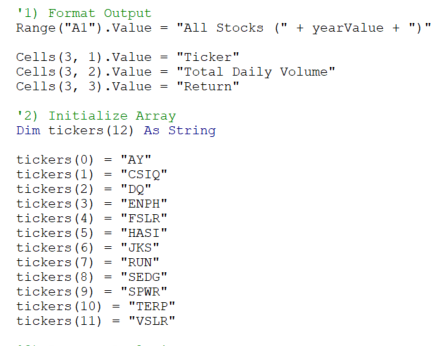
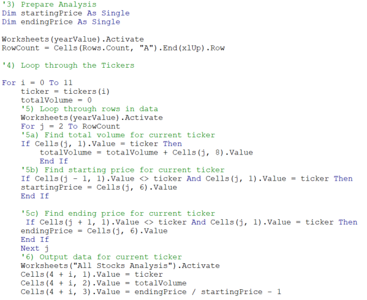

# Stock-Analysis

## Overview 
The purpose of this analysis was to help a friend, Steve, gather stock market information specific to one publicly traded company, DAQO Energy and a number of other stocks in the energy space. As a follow up to the initial stock analysis i refactored the VBA code to run faster and more efficiently. 
 
 ## Results
 #### Stock Analysis
 Using images and examples of your code, compare the stock performance between 2017 and 2018, as well as the execution times of the original script and the refactored script.
 Analyzing the series of energy stocks for Steve has led me to several conclusions. In 2017, using the sample of 12 stocks, the energy sector performed well with 11 of 12 stocks (see figure 1) giving positive returns to shareholders. DQ notably was the top performing stock in the sample group in 2017, with a return of 199.4%.  While stock performance across the sample was great in 2017, 2018 did not provide positive returns for the majority of the sampled stocks (see figure 2). in 2018 DQ had a return of -62%, giving back a portion, though not all, of the gains made in 2017.
 
 #### Refactoring
the initial analysis was performed by creating an array of the 12 tickers (figure 3), and then using a loop to identify 3 variables for each ticker: 1) Volume 2) Starting Price 3) ending price (Loop code - see code in figure 4). I found this to be a simple way to pull the necessary data to provide % Return, and volume data to Steve to help inform his decision.

While the first pass got the job done, the coding was not the most efficient. To improve efficiency, i refactored the code. By setting ticker index variable = 0, and declaring Volume, Starting Price, & Ending Price each as a variable, the operator is able to use a for loop (figure 5) to comb through the data, and identify starting and ending prices. ending price determined when the following ticker does not match. 

 
 ## Summary
 Summary: In a summary statement, address the following questions.
What are the advantages or disadvantages of refactoring code?
How do these pros and cons apply to refactoring the original VBA script?

### Figure 1:
 

### Figure 2:

### Figure 3:

### Figure 4:

### Figure 5:

